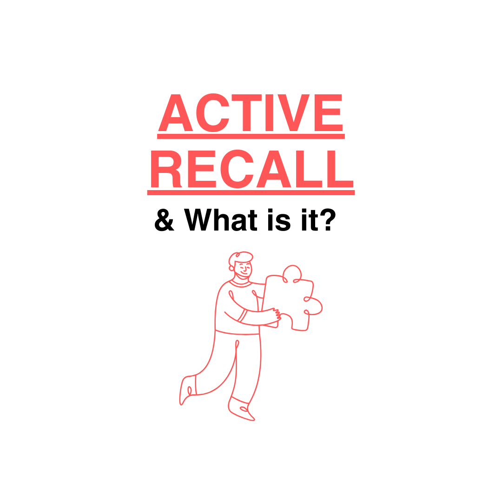
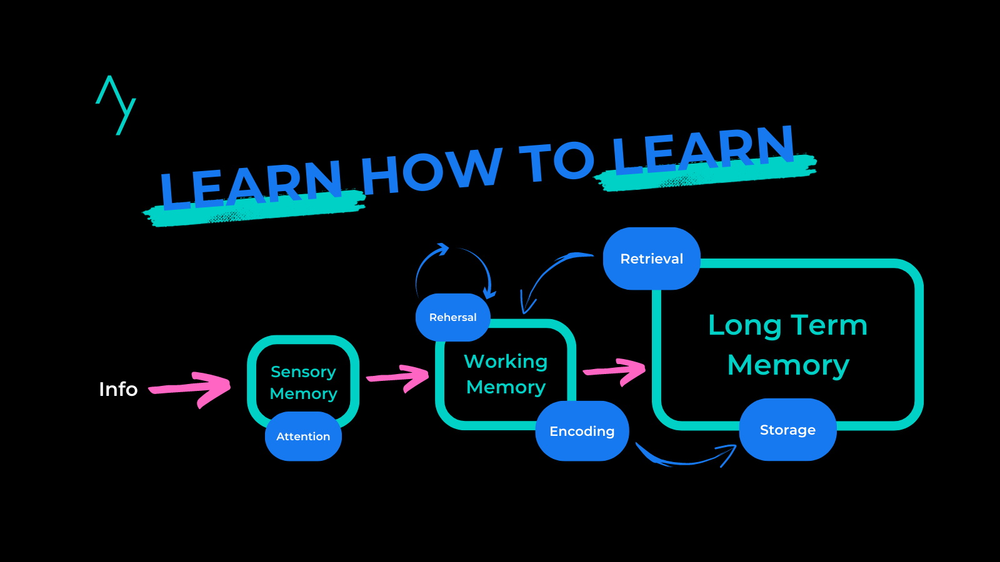
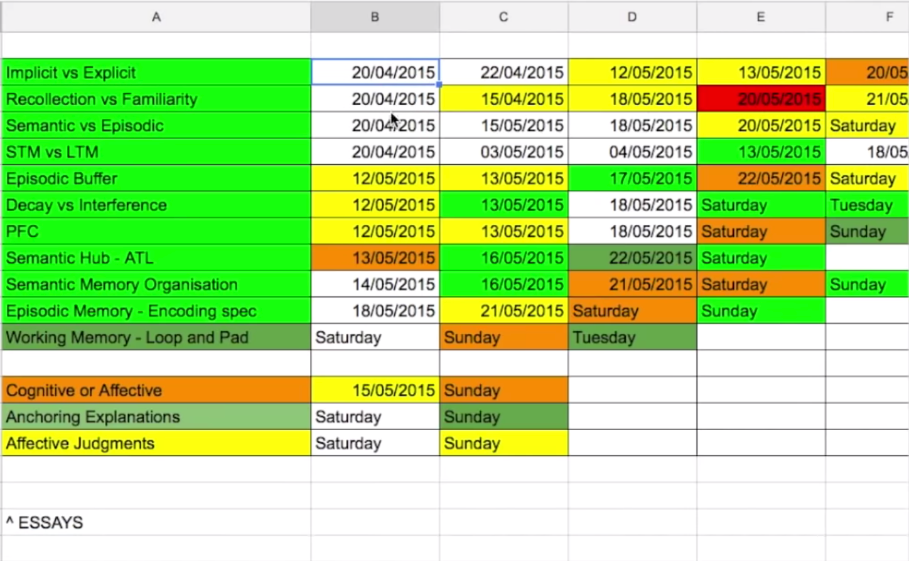

### Mastering Active Recall: Strengthening Your Learning (with Topical Questions!)

In the pursuit of efficient learning, active recall stands out as one of the most effective methods for retaining and applying information. Ever spend an entire day studying, feel great about it, and then realise you don’t remember a thing? Same here. Been there, done that.

Active recall is a game-changer. This method challenges your brain to actively pull out information, helping you lock it into long-term memory. It’s like a mental workout that boosts your ability to recall stuff when it really counts.

In this post, we’ll explore how you can use active recall to its full potential, with action steps on how to apply it effectively, especially through topical questions.

### What is Active Recall?

Active recall is the practice of trying to remember information without looking at the material. Instead of rereading or highlighting, you actively engage your brain by attempting to retrieve information you have learned. Retrieval strengthens long-term memory and keeps information active in your working memory, making it easier to access when needed, such as during a test or in daily life. This is proven to boost memory retention and improve understanding compared to passive study techniques.

[If you’re interested to dive deeper into how it all works!](https://blog.alexanderfyoung.com/active-recall-study-technique/)

### Why Topical Questions?

Topical questions target specific areas of a subject, helping you focus on weak spots. They are designed to test your understanding of particular topics and help you recognise where you're falling short. When you're unfamiliar with a subject or struggling with certain concepts, topical questions pinpoint these areas and challenge you to actively recall and process the information.

_💡 Tip: Exams often test topics in similar ways, so to score well, you need to master how to apply your knowledge. Active recall is the key to doing that effectively._

---

### Steps to Use Active Recall with Topical Questions

#### 1. **Create or Source Topical Questions**

Start by breaking down your subject into manageable sections. For each section, create a list of topical questions that test your understanding. For example, a student taking ‘O’ Level Chemistry could divide the subject into topics like acids and bases, chemical bonding, and electrolysis. Then, craft questions like:

- _What is the difference between strong and weak acids, and how do they behave in water?_
- _Explain the formation of ionic bonds between sodium and chlorine atoms._
- _Describe the electrolysis process of aqueous copper(II) sulfate solution using copper electrodes._

**🤓 Actionable Tip**: If you're not sure how to create good questions, look at your textbooks, past exam papers (highly recommend), or online resources like Quizlet or Anki to get question prompts.

#### 2. **Attempt to Answer Without Looking at Your Notes**

This is where the core of active recall comes into play. Try to answer each question from memory without referring to any materials. If you're unable to answer a question, make a note of it — this signals an area of weakness.

**🤓 Actionable Tip**: Set a timer and give yourself 2-5 minutes per question to simulate exam pressure. This helps mimic real-world recall situations, such as exams or presentations.

👋 *Psst… A personal tip is: Don’t worry about your pride here—it’s totally fine if you can’t answer a few questions or even forget how to tackle them. The worst that can happen is you’ll either refresh your memory or learn something new during the session!*

#### 3. **Review the Material Only After You Struggle**

When you find questions you can’t answer, resist the urge to immediately check your notes. Spend a few minutes trying to work through it mentally. Only after a thorough attempt, refer back to your materials to review the correct answer.

**Actionable Tip**: Use colour coding or highlighting when reviewing materials to mark areas where you struggled. Highlight the questions directly, or if you have time, do up a tracker for future reference - this allows for quick identification when revisiting later.

[For example, use red for questions you couldn’t recall, yellow for partially correct answers, and green for those you nailed easily.](https://aliabdaal.com/the-ultimate-guide-to-studying-for-exams/)

#### 4. **Reattempt the Same Questions the Next Day**

One of the most powerful elements of active recall is [spaced repetition](https://teebloc.com/blog/spaced-repetition). Once you’ve identified difficult areas, make sure to revisit the same questions the following day. The act of repeatedly recalling information strengthens memory over time.

**Actionable Tip**: Use a spaced repetition system (SRS) like Anki (or you could manually send reminders to yourself) to schedule when you should attempt to answer those questions again, progressively increasing the time intervals between each review.

#### 5. **Turn Your Incorrect Answers into More Questions**

When you get a question wrong or struggle to answer, dive deeper. Convert your mistake into a more focused question. For example, if you misunderstood the concept of energy transfer, ask yourself:

- _What are the stages of energy transfer in a food web?_
- _What role do producers play in the flow of energy?_

**Actionable Tip**: After reviewing the answer, take a few seconds to write down more refined or targeted questions to ensure you're not just memorizing the answer, but fully grasping the concept.

#### 6. **Mix in General and Detailed Questions**

While topical questions are essential, balancing them with general questions can help ensure you don’t miss the bigger picture. For example, in Biology:

- _Explain the role of DNA in the cell lifecycle_ (general).
- _What enzymes are involved in DNA replication?_ (detailed).

**Actionable Tip**: Begin your study sessions with broader questions, then narrow down to detailed ones as you progress through the material.

---

### Tools to Assist Active Recall

#### 1. **Flashcards (Digital or Physical)**

Platforms like Anki, Quizlet, or even physical index cards are fantastic tools to facilitate active recall. Write your questions on one side and answers on the other. Periodically shuffle through these to keep your brain engaged and continuously retrieve information.

**Actionable Tip**: Use flashcards for difficult questions and review them more frequently in the beginning. As your understanding improves, space them out over longer intervals.

#### 2. **Study Groups**

Collaborating with others can enhance active recall. By quizzing each other with topical questions, you expose yourself to different perspectives and fill gaps in your knowledge.

**Actionable Tip**: In study groups, everyone should come with 5-10 topical questions to quiz the group. Use it as a productive exchange of knowledge and clarification.

#### 3. [Highly recommend when you don’t have much time left] **Self-Testing in Different Formats**

Quizzes, past exam papers, or verbal explanations can all engage active recall. Even explaining a concept to someone else is a great way to test your memory.

**Actionable Tip**: At the end of your study session, take 5-10 minutes to explain difficult concepts to a friend, family member, or even just yourself. The act of explanation reinforces learning.

👉 If you're short on revision time, dive straight into past year papers! They come with ready-made questions in the exam format and are perfect for testing your understanding of the subject.

[Create your own targeted topical questions](https://teebloc.com/) to assess your understanding using Teebloc. It’s ready in just minutes, so you won’t waste precious time flipping through past year papers!

---

### TLDR: Why Active Recall with Topical Questions Works

- **Faster Identification of Weak Areas**: Topical questions immediately show you where your knowledge is lacking, allowing you to focus your review more efficiently.
- **Improved Retention**: Active recall strengthens neural pathways, helping you remember information longer.
- **Exam-Ready Confidence**: Repeatedly practicing active recall simulates exam-like pressure, reducing anxiety when it’s time to perform.
- **More Efficient Studying**: Instead of spending hours reading, active recall condenses study time by focusing on retrieval practice.

---

### Final Thoughts

Using active recall combined with topical questions is one of the most effective ways to strengthen your learning and memory. It not only helps you understand your weak areas but forces you to engage more critically with the material. Over time, this method leads to deeper retention and a more confident mastery of complex subjects.

So, the next time you sit down to study, swap passive review with active recall and topical questioning — you’ll be surprised at how much more you retain!
