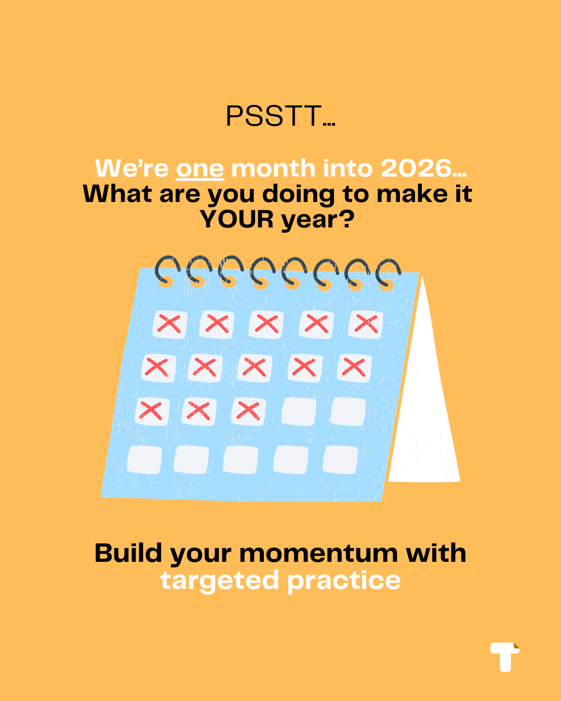

### We're one month into 2026. What are you doing to make it YOUR year?

As we ease into 2026, many students across Singapore are catching their breath, but the most successful ones are already thinking ahead. Because how you _start_ this year shapes how you well you end it.

Dr. Carol Dweck, psychologist at Stanford University, famously said:

> “The path to success is built on preparation — consistent effort, not overnight change.”

So what can you do at the start of 2026?

✅ **For Students:**

Reflect on your 2025 learning journey. Which subjects drained the most time or confidence? Spend this month reinforcing weak spots. Even 15 minutes a day compounds over time. The habits you build now decide how ready you’ll be when 2026 gets tough.

✅ **For Parents:**

Support isn’t about spending more; it’s about planning better. Instead of scrambling for assessment books this month, use this window to explore smarter tools that give your child access to _all subjects_ and _real-school exam questions_ in one place.

✅ **For Teachers & Tutors:**

Now’s the time to refresh your materials and streamline this year’s lesson plans. Studies show that students who practice with _authentic exam questions_ perform significantly better in conceptual understanding and application.²

✨ The best time to start is yesterday, but you’re in luck because the next best time to start is today.

Your 2026 success story begins _now!_

  

    <a href="https://accounts.teebloc.com/sign-up?redirect_url=https://app.teebloc.com/" class="hover:no-underline text-white">At Teebloc, we make this easy!</a> Giving affordable access to thousands of Singapore school past-year papers for just $8.50/month. It’s one small step today that sets up a stronger 2026 tomorrow.

  

**References:**

1. Ministry of Education Singapore (2024). _Annual Student Learning and Transition Report._
2. Cambridge Assessment (2023). _Research on Authentic Exam Practice and Student Outcomes._
