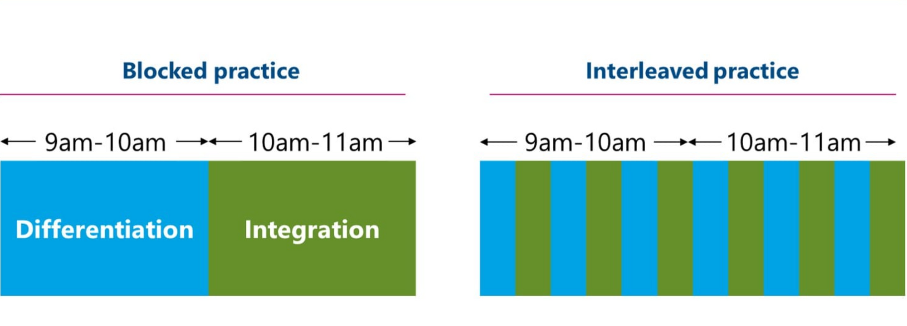

# **Mastering Interleaving: Strengthening Learning with Strategic Variety**

Want to study smarter, not harder? Interleaving might be your new go-to hack! Instead of sticking to one topic, try mixing different subjects or concepts within a single study session. This technique makes your brain work a bit harder, boosting engagement and retention—like shuffling through your playlist instead of playing the same song on repeat!

In this guide, we’ll show you how to make interleaving part of your study routine with easy steps and actionable tips! 🚀

---

### What is Interleaving?

Interleaving means studying different topics in a mixed-up order, rather than focusing on one subject at a time. For example, instead of doing two hours on one math concept, you’d switch between algebra, geometry, and calculus. This makes your brain work harder to remember and connect ideas, boosting comprehension and retention.

---

### Why Use Interleaving?

While switching topics may feel tricky, it actually improves your ability to apply knowledge in varied ways. Studies show it enhances understanding and problem-solving. Plus, it keeps studying fresh and reduces mental fatigue from focusing too long on one thing.

_💡**Tip**: Interleaving is especially useful for overlapping subjects like math, languages, or sciences._

---

### Steps to Use Interleaving Effectively

### 1. **Divide Material into Related Topics**

Break your subject into main topics. For example, in Biology, cover cell structure, energy transfer, and genetics. Rotate through these different areas in one session.

---

### 2. **Switch Topics Often**

Change topics every 20-30 minutes. Instead of finishing all cell structure questions, switch to energy transfer, then genetics, then loop back.

_💡**Tip**: Use a timer to remind you when to switch._

---

### 3. **Use Mixed Practice Problems**

Try mixed questions to practice identifying and solving different types of problems. This mimics exams where questions aren’t neatly separated by topic.

_💡**Example**: For math, do a mix of geometry, algebra, and calculus._

---

### 4. **Review Connections Between Topics**

After each session, spend a few minutes reflecting on how the topics connect, which strengthens understanding. For instance, see how energy transfer in cells relates to genetics.

---

### Tools to Help with Interleaving

1. **Flashcards (Digital or Physical)**: Use Quizlet or Anki for mixed flashcard decks covering multiple topics.
2. **Past Papers and Mixed Exercises**: Past exam papers often have questions that interleave topics, making them perfect for practicing this approach.
3. **Study Groups**: In groups, each person can bring questions on different topics, creating a naturally interleaved session.

---

### Why Interleaving Works

- **Strengthens Memory**: Switching topics builds mental flexibility, improving retention.
- **Encourages Understanding**: It helps you see the "big picture" and how concepts connect.
- **Prepares You for Real-World Application**: Exams often test mixed topics—interleaving prepares you for that challenge!

---

### Final Thoughts

Interleaving may feel challenging initially, but it’s a powerful way to deepen learning and retain more. Next time you study, give it a try and watch your understanding grow!
