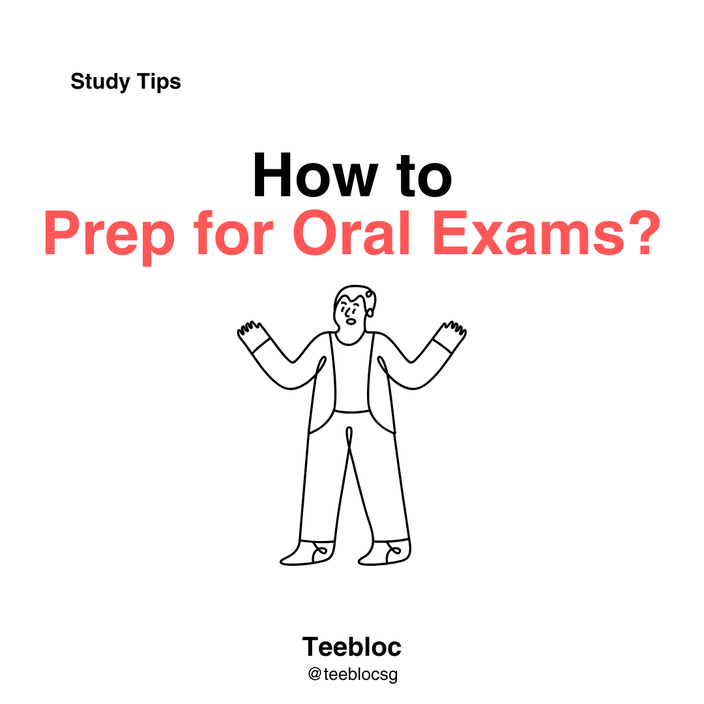

### **Sample At-Home Method:**

Example: O Level 2023 Day 1 Topic Sample [Patriotism]:

You will watch a video showing national servicemen doing push-ups and team bonding activities, with a crowd of NSmen cheering them on and recording videos.

As you watch the video, think about how you will respond to related prompts such as:

- **Who are the people watching the event, and what could they be thinking?**
- **What do you think the people watching the video are feeling?**
- **Could this be an NSMen cohesion day? Why might such activities be organised?**

You can also practice answering typical O-Level Spoken Interaction questions, such as:

- How could school and family contribute to a teenager’s character development?
- What do you think parents and schools can do to teach their child good morals?
- What can schools and parents do to cultivate a child’s character?
- Should students join uniform groups? Why or why not?
- Do you think everyone can join uniform groups?
- Should all students join uniform groups as their CCA?

Write down key points on paper and refer to them during your presentation.

You have 10 minutes for this section.

---

**Step-by-Step:**

1. **Record Your Response.**
2. **Transcribe Your Recording:**
   - Use a transcribing tool to record your oral presentation.
   - You may use Microsoft Word’s “Transcribe” tool (found under the Dictate button). Alternatively, search online for “transcribe recording to text” using any transcription website.
3. **Upload your transcript to Google Docs and share it with your teacher.**
4. **Go to ChatGPT and use this prompt:**

   _Please help me edit my response to the question: [Insert Question Here, e.g., “Who are the people watching the national servicemen event, and what could they be thinking?” or “Should students join uniform groups?”]. When you edit my response, please ensure that my response is well-developed and organised, with a wide range of vocabulary and structures. This is my response: [Insert Your Response Here]._

5. **Compare ChatGPT’s revised version with your own:**
   - Highlight ChatGPT’s changes in yellow.
   - Reflect: What worked better in the ChatGPT version?
   - What techniques or phrases can you adopt?
6. **Practice out loud using the improved version, but make the words your own!**

   **Internalise** the ideas, **don’t memorise!**

---

Using AI tools like ChatGPT can help refine your answers, broaden your vocabulary, and structure your thoughts more clearly, all essential skills for excelling in your O-Level Oral exams.

---

  

    <a href="https://accounts.teebloc.com/sign-up?redirect_url=https://app.teebloc.com/" class="hover:no-underline text-white">Sign up for Teebloc</a> to create custom worksheets by topic, using questions from Singapore top schools.
  

