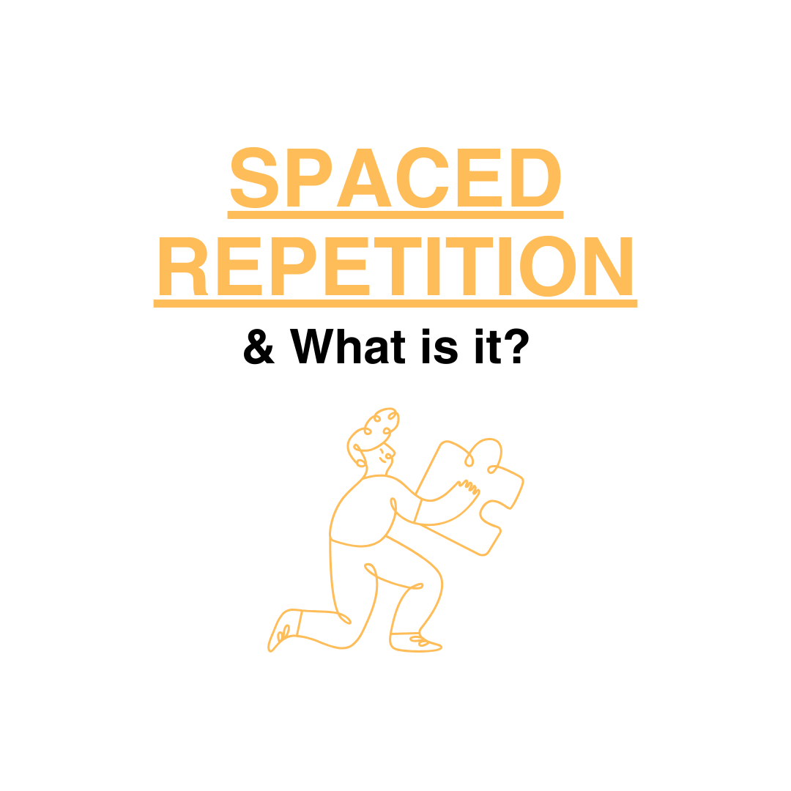
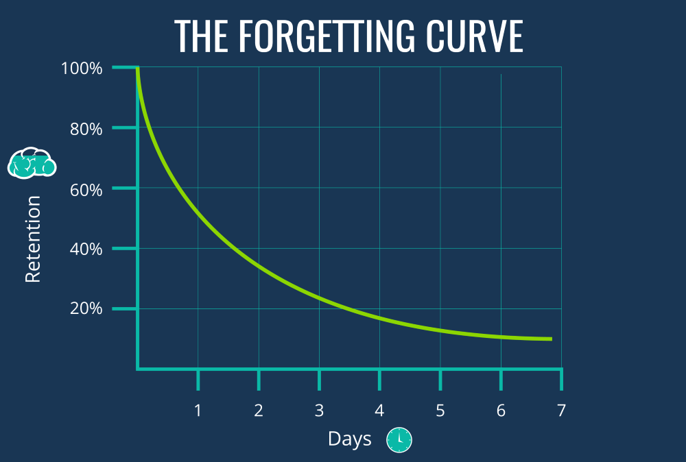
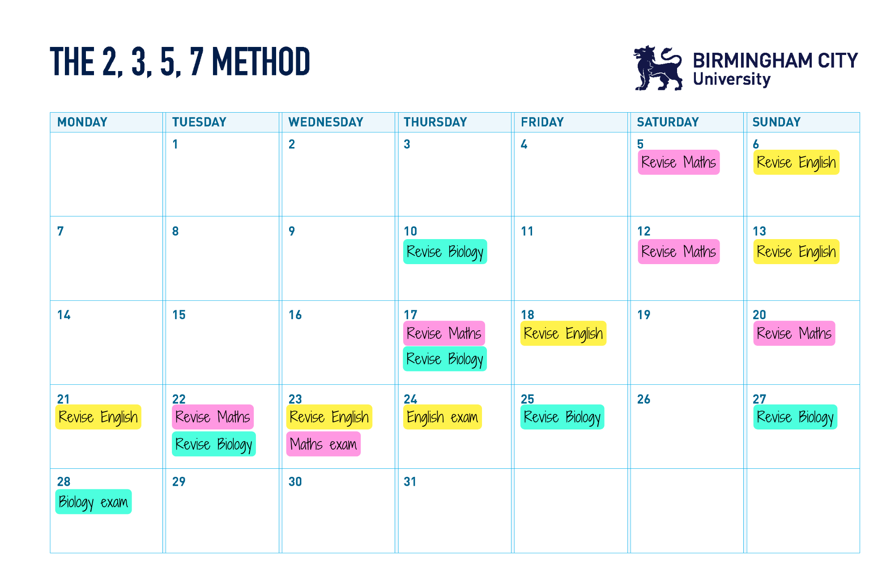

### Mastering the Art of Spaced Repetition: The Ultimate Study Strategy

In today’s fast-paced world, where information is constantly bombarding us, it’s easy to feel overwhelmed when trying to retain what we learn. Whether you're a student preparing for exams or a lifelong learner, many common study methods may leave you cramming, forgetting, and stressing. Not with **spaced repetition**—a proven and effective way to enhance long-term memory and improve retention.

### What is Spaced Repetition?

Spaced repetition is a learning technique that involves reviewing information at increasing intervals over time. Instead of repeatedly cramming content in a short span, you space out your study sessions in a way that aligns with how memory works. By doing so, you combat the brain's natural tendency to forget things, known as the “forgetting curve.”

### The Science Behind It

The key principle behind spaced repetition lies in the **Ebbinghaus Forgetting Curve**. When you first learn something, your brain forgets it quickly unless you revisit the material. Each time you review it, the decay slows down, and you retain the information longer.

[_Picture Reference_](https://www.google.com/url?sa=i&url=https%3A%2F%2Felearningindustry.com%2Fforgetting-curve-combat&psig=AOvVaw0S9UPbLwu-EZgsU5K_Keq3&ust=1726401749826000&source=images&cd=vfe&opi=89978449&ved=0CBQQjRxqFwoTCIijgOqxwogDFQAAAAAdAAAAABAE)

Spaced repetition aligns your review schedule with this forgetting curve, helping you focus more on what’s starting to slip from memory and less on what’s still fresh. Over time, this enhances your ability to recall and store information easily in your long-term memory.

### How to Use Spaced Repetition to Study Effectively

Here’s a step-by-step guide to integrating spaced repetition into your study routine:

### 1. **Break Down Your Material**

Instead of trying to absorb everything at once, break your study material into smaller, manageable chunks. Flashcards or concise notes work well for this. Platforms like [Anki](https://apps.ankiweb.net/) or [Quizlet](https://quizlet.com/ca) make this easier by digitising your notes and helping you organise the material.

### 2. **Use Spaced Repetition Software**

Tools like Anki, Quizlet, or even Notion’s recall features can help you automate your spaced repetition practice. These apps are built around algorithms that determine when you're most likely to forget a piece of information and prompt you to review it just before that happens.

### 3. **Follow the Right Spacing Intervals / Create a Schedule!**

[\*The 2,3,5,7 Method](https://www.bcu.ac.uk/exams-and-revision/best-ways-to-revise/spaced-repetition) (A method to plan out your intervals)\*

The idea is to review the material at intervals that become progressively longer. For example:

- Review after 1 day
- Review after 3 days
- Review after 7 days
- Review after 14 days
- Review after 1 month
- Adjust these intervals based on the complexity of the content and your personal retention rate. The more you correctly recall something, the longer you can wait before reviewing it again.

### 4. **Active Recall is Key**

Spaced repetition works best when paired with **active recall**, which means testing yourself on the material rather than passively reading it. When you force your brain to retrieve information, it strengthens your memory and makes it easier to recall later.

### 5. **Track Your Progress**

Whether you use an app or physical flashcards, track which areas you're struggling with. As you progress, you'll notice a pattern of concepts that require more frequent reviews. Pay extra attention to these weak spots while slowly easing off the concepts you’ve mastered.

### 6. **Be Consistent**

Like any skill, spaced repetition requires consistency. Set aside time each day for your study sessions. Even 10-15 minutes daily can work wonders. The key is regular, small efforts over time rather than a single massive cramming session.

### TLDR: Why Spaced Repetition Works

- **Combats Forgetting**: It directly tackles the forgetting curve by reintroducing information just when you're about to forget it.
- **Improves Focus**: By prioritizing the material you're more likely to forget, you're studying smarter, not harder.
- **Reduces Study Time**: Over time, spaced repetition reduces the need to constantly review all material, allowing you to focus on the areas that need attention.
- **Builds Confidence**: Knowing that you’re actively retaining information over time can boost your confidence, reducing last-minute exam stress.

### **If you’re not one to read, here’s an old but gold video to learn more about spaced repetition:**

<iframe width="100%" height="400" src="https://www.youtube.com/embed/Z-zNHHpXoMM?si=XXOBHVvPIhX3rToc" title="YouTube video player" frameborder="0" allow="accelerometer; autoplay; clipboard-write; encrypted-media; gyroscope; picture-in-picture; web-share" referrerpolicy="strict-origin-when-cross-origin" allowfullscreen></iframe>

### Tips for Success

- **Start Early**: Begin using spaced repetition as soon as you learn new material. The sooner you implement it, the more effective it will be.
- **Combine with Other Study Techniques**: Spaced repetition can be paired with other methods, such as mind maps, note-taking, or teaching others to reinforce what you’ve learned.
- **Tailor the Intervals**: If you're studying for an exam in a few weeks, condense your repetition schedule to review material more frequently.

### Conclusion

Spaced repetition is a simple yet powerful tool that transforms the way we learn. By optimizing how and when you review information, you can enhance your memory, study efficiently, and reduce the stress of last-minute cramming. Next time you prepare for a big exam or project, give spaced repetition a try—you’ll be amazed at how much more you remember.
