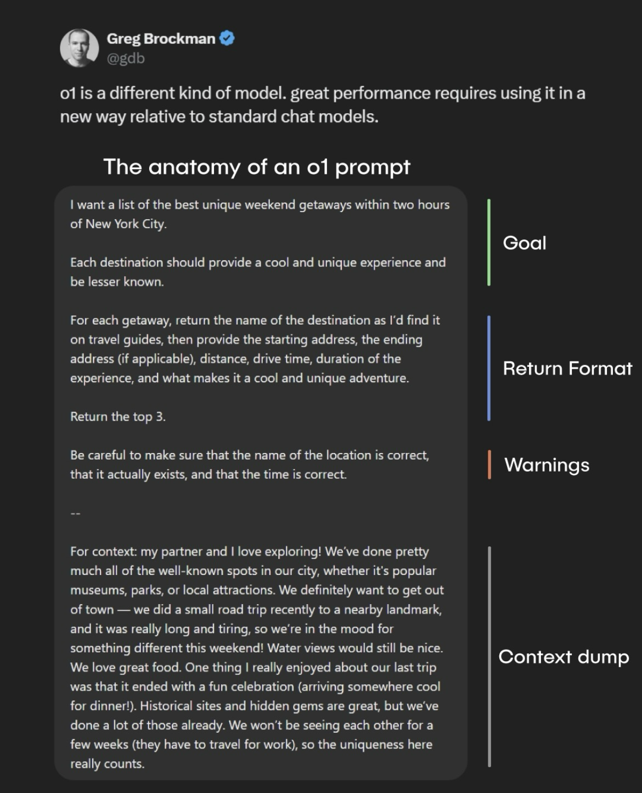

“Am I just being lazy if I use ChatGPT?” “Is it cheating?”

These are common concerns when it comes to AI-powered learning. But instead of asking _if_ you should use AI, a better question is: _How can you use AI effectively?_

AI isn’t replacing learning—it’s reshaping how we acquire knowledge. A recent poll found that **88% (almost 9 in 10) of UK university students** now use AI tools like ChatGPT for assessments, up from just 53% last year. The shift is clear: AI is here to stay. So how can you harness it to accelerate your learning without compromising on understanding?

Let’s break it down using insights from Greg Brockman, co-founder and president of OpenAI.

## 1. Define a Clear Goal

ChatGPT has endless ways to answer a question, so it’s crucial to **narrow down what you need.** Instead of a vague request like “Help me with Science,” try:

✅ Science: “Explain the life cycle of a frog using simple terms suitable for a Primary 4 student, with examples.”

✅ Math: “Solve this Primary 5 problem sum step by step: ‘Ali has 36 marbles. He gives 1/4 of them to Ben and 1/3 to Charmaine. How many does he have left?’”

✅ English: “Create a short composition about ‘A Rainy Day’ for a Primary 3 student, using at least five adjectives.”

By being specific, you steer AI in the right direction, saving time and ensuring you get actionable insights.

## 2. Set the Right Return Format

The way information is presented can make or break your understanding. If you're summarizing a book, do you want **bullet points, a paragraph, or a dialogue-style breakdown?**

For example:

💡 Science: “Summarise the three states of matter in a table, comparing their shape, volume, and particle arrangement.”

💡 Math: “Give me a step-by-step explanation of how to do long division, in bullet points.”

💡 English: “Rewrite this sentence in three different ways: ‘The boy quickly ran to school.’”

Customising the output format makes the information easier to digest and apply.

## 3. Give AI Constraints (Warnings)

AI doesn’t think like you—it follows instructions. That’s why **guidelines matter.** If past explanations were too complex, add a constraint:

🚫 **Math:** _“Explain how to find the area of a triangle, but do NOT use advanced algebra—keep it at a Primary 5 level.”_

✅ **Science:** _“Describe how plants make food, as if you were teaching a Primary 3 student. Use simple words.”_

🚫 **English:** _“Rewrite this paragraph using only words a Primary 2 student would understand.”_

By telling AI what _not_ to do, you get a response that is better tailored to your needs.

## 4. Provide Context for Better Answers

AI isn’t a mind reader. The more **context** you provide, the more relevant and insightful its responses become. If you’re studying for an exam:

📌 **Science:** _“I have a test on the water cycle. Can you quiz me with five multiple-choice questions based on Primary 4 science syllabus?”_

📌 **Math:** _“I keep getting confused with fractions. Can you explain it with a real-life example, like sharing a pizza?”_

📌 **English:** _“I need to write an oral presentation about ‘My Favourite Hobby’ for a Primary 5 speech. Can you draft a one-minute script?”_

This makes ChatGPT a **learning assistant** rather than just an answer machine.

## The Bottom Line

ChatGPT isn’t a shortcut—it’s a tool. When used strategically, it **amplifies learning, accelerates research, and sharpens thinking.** The key is knowing how to ask the right questions.

So next time you open ChatGPT, don’t just ask _for_ an answer. Ask _for_ the right answer, in the right format, with the right context. That’s how you make AI work for you. 🚀

Speaking of AI, streamline your practice with **Teebloc**—a smart worksheet generator powered by LLM technology that curates questions just for you. **Sign up now and enjoy 3 free worksheet downloads!** 🚀📚
