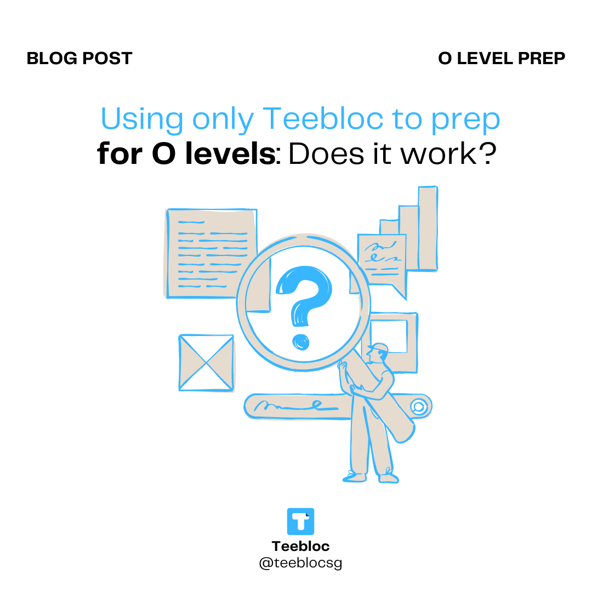
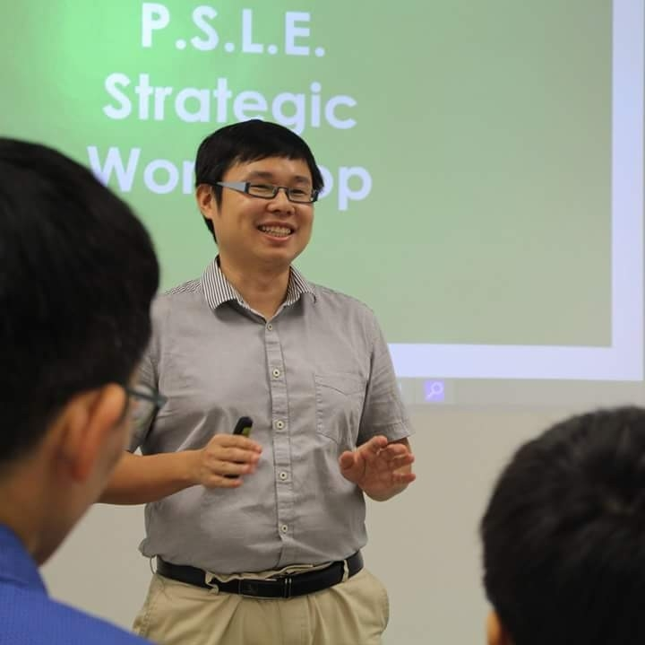
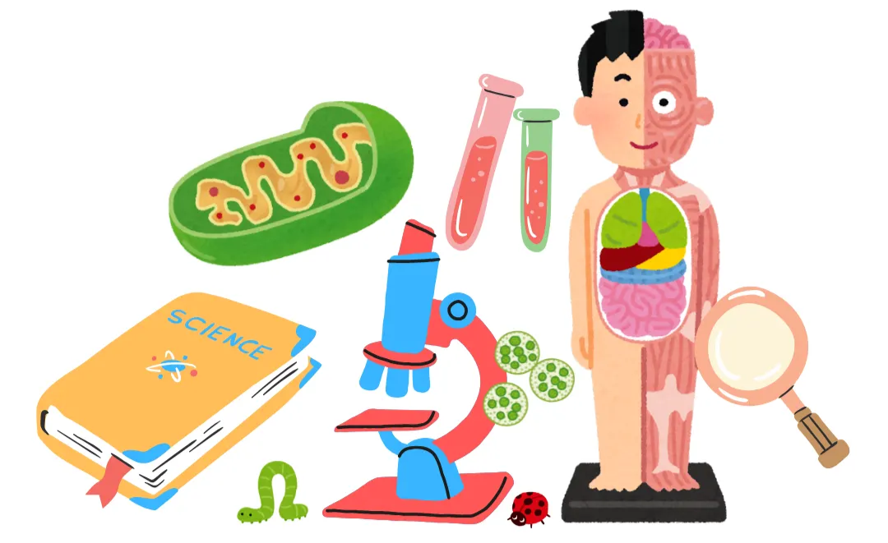

When it comes to preparing for the O Levels, few understand the exam as deeply as Mr. Linus, a veteran tutor who has been teaching the local syllabus since 2001, starting from his university days. As an entrepreneur and philanthropist in education, he has taken the national exam nearly every year over the past decade to better empathise with his students and stay attuned to their challenges.

Featured in [_The Straits Times_](https://www.straitstimes.com/life/english-physics-chemistry-these-tutors-take-o-level-exams-every-year), [_Lianhe Zaobao_](https://www.zaobao.com.sg/news/singapore/story20250924-7562459?utm_source=facebook&utm_medium=sm&fbclid=IwdGRzaANAwW9leHRuA2FlbQIxMQABHjfuHBLMVa6h6773r8WOm1H_OI7bCs4SqUuSJLOJwNuHY02PiQ6PezvvffYF_aem_1w32TRBqbkGfil7Pi86kdg&sfnsn=wa), [_The New Paper_](https://www.tnp.sg/news/im-your-war-mate-now-tutors-who-retake-o-level-exams-and-use-tiktok-connect-students) and [_AsiaOne_](https://www.asiaone.com/lifestyle/tutor-doesnt-just-teach-o-level-exams-he-takes-them-too-every-year), Linus isn’t just a teacher; he’s a “war mate” who steps onto the very same battlefield as his students. His philosophy is simple: to teach well, he must first walk in his students’ shoes.

Inspired by his unique approach, we reached out to Linus, who has seen it all, and invited him to take on a fresh challenge: **to rely solely on Teebloc for three days of revision in Pure Biology**. Could Teebloc alone get him exam-ready? Here’s his experience and his candid take on how effective Teebloc really is.

# Q&A with Linus

**Q: You’ve taken O Levels multiple times over the past 10 years, what motivates you to keep sitting for the exams?**

**Linus:** The main purpose is to understand how my students feel during the exam. There are much
more than just to know about the question difficulties and questions asking style, which are
things I can easily get from TYS. **However, what TYS can’t help me with is empathy.** If I take O
level exam myself with my students, when they talk to me after the exam, I can connect with
them very well and understand what they must have felt about certain questions. This can
help me to strategise with them for their next paper and also help me to manage their
expectations and also for me to advise them better.
Then I can share these stories to my students in the next batch so that they are also mentally
prepared for what their senior has experienced.

---

**Q: How have your revision methods evolved across the years?**

**Linus:** In the past, just grinding through Ten-Year Series (TYS) could get students A1s and A2s in Pure Sciences. Today, the syllabus focuses more on problem solving and real-life applications, so it’s not enough to memorise model answers. From my experience, revision methods should be different depending on the student’s level.

**For Sec 3 students**, **TYS (Topical)** is the best primary tool to build conceptual understanding. It can help most students reach around **B3/B4**, but to push for **A1/A2**, they need to practise **school prelim papers**. The problem is, prelim papers aren’t sorted by topic, and schools teach topics in different sequences — so students (or tutors) must carefully pick the relevant questions.

**For Sec 4 students**, **prelim papers should be the main revision tool** to aim for distinctions, while **TYS (Yearly)** is best used closer to the O Levels to manage expectations of exam difficulty.

**For Combined Science students**, the approach is similar, but **TYS remains more important through Sec 3 and the first half of Sec 4**. From the **June holidays of Sec 4 onwards**, they should switch focus to prelim papers, since Combined Science is generally easier than Pure Sciences.

---

**Q: Which subject(s) do you find most challenging to prepare for, and why?
Linus:** It really depends on whether you find Math easy. For me, that makes Pure Physics easier to score in compared to Pure Chemistry. In my view, both Chemistry and Physics are about the same in difficulty. Pure Biology is the easiest of the three to study, since the questions are more predictable, though it does require a lot of memorisation after understanding. Some skills from Chemistry also transfer to Biology, so I find those two subjects more similar than comparing Chemistry with Physics.

---

## 3 Days: Using Only Teebloc

**Q: For this blog challenge, you used only Teebloc for 3 days of Pure Biology revision. Walk us through your process.**

**Linus:** I chose Pure Biology because it’s the subject I have the least experience with. I only started studying it in 2020 when I took my first O Level Biology exam. So I needed to put in extra effort here.

To build up my **conceptual understanding**, I started with **MCQs**, going through them topic by topic. Questions I was confident about, I skipped; the ones I wasn’t sure of, I added into a worksheet after writing my answers on foolscap paper. After finishing each topic, I checked my answers and compiled a set of the harder questions to retest myself later. This way, I kept drilling weak spots until I could get them all right.

From my experience, it’s actually possible to get **full marks in MCQs for all Pure Sciences.** I’ve done it many times over the past 10 years. **Students should aim to practise until they literally** **run out of MCQs they can’t solve, that’s** when you know you’ve reached peak readiness.

Once I was confident with MCQs, I moved on to **Paper 2**. I generated long-answer questions (3–8 marks), studied the model answers, and memorised the key points. The next day, I would recall everything from memory and check for missing details. Repeating this for each topic helped me master the **answering techniques and sequences** needed to score well.

After that, I focused on the other Paper 2 components, graphs, data-based questions, short answers, and labelling, which are usually easier to handle.

Teebloc made this whole process very **convenient**, and I believe I can score an **easy A1 for Biology MCQ and Paper 2** this year. Of course, the only part Teebloc doesn’t cover is the practical exam.

That said, I do hope Teebloc can improve by adding:

- A feature to **re-select questions from existing worksheets** (to build new sets from past mistakes).
- An option to **hide/unhide questions already added** (so I don’t keep scrolling past repeats).

---

**Q: After the 3-day trial, did you feel more prepared or confident in that subject? On a scale of 1–10, how easy was it to generate worksheets?**

**Linus:** Yep! I’d rate it a 7. It’s simple to use, but the “show similar” feature sometimes pulls in questions from other subjects. A filter option would help.

---

**Q: How effective were Teebloc practices compared to your usual resources like TYS or past papers?**

**Linus:** Very effective. Being able to generate questions by topic from past school papers is extremely helpful. Teebloc questions are tougher than TYS, and **practising by topic is more effective than just reading notes.**

---

**Q: What stood out most about Teebloc’s user experience?**

**Linus:** It’s easy to use. Just a few clicks and I get the questions I want. Plus, I don’t need to buy an entire practice book just to focus on one topic.

---

**Q: Can Teebloc replace traditional resources?**

**Linus:** Not fully. TYS is still useful for new learners and those about to sit for the exam. And confident students will still want yearly papers, which Teebloc doesn’t provide. But for **targeted topic practice**, Teebloc is excellent.

---

## Final Thoughts

**Q: Do you see AI-powered tools like Teebloc becoming mainstream in exam prep?**

**Linus:** Yes, definitely. If Teebloc adds an _Explain_ button to show why answers are correct, it would be a game-changer, even more convenient than ChatGPT, and potentially revolutionise or disrupt the tuition industry.

---

**Q: Based on your 10+ years of O Level experience, what’s your single best study tip for students?**

**Linus:** If you’re weak, focus on MCQs first. Once you’re solid, move on to open-ended questions. And remember, results aren’t a judgement of who you are, but a diagnostic tool to improve. Don’t be afraid to seek help when needed.

---

## In Summary

Linus’ three-day trial showed that **preparing with just Teebloc is not only doable, but surprisingly effective**. It helped him focus on weak spots, drill smarter, and save time sorting through endless papers. Of course, tools like TYS and yearly papers still have their place — but Teebloc adds a new layer of flexibility that makes revision less overwhelming.

At the end of the day, every student’s journey is different. **What matters is finding a method that helps you stay consistent, build confidence, and walk into the exam hall ready.** For Linus, Teebloc proved to be a valuable companion, and it just might be for you too.

  

    <a href="https://accounts.teebloc.com/sign-up?redirect_url=https://app.teebloc.com/" class="hover:no-underline text-white">Sign up for Teebloc</a> to create custom worksheets by topic, using questions from Singapore top schools. New users get 3 free worksheets!
  

